# VProfile GitOps on AWS EKS

A GitOps-based CI/CD setup for a Java web application deployed on AWS EKS using GitLab pipelines, Terraform, and Helm.

---

## Project Structure

```
gitlab4gitops/
├── vprofile-java-app/        # Java app source + CI pipeline
├── infra-eks-terraform/      # EKS cluster provisioning via Terraform
└── vprofile-helm-charts/     # Helm charts for Kubernetes deployment
```

---

## How It Works

Three separate GitLab repositories, each with its own pipeline:

### 1. `vprofile-java-app` — App CI Pipeline

Triggered on `main` branch or merge requests.

| Stage | What it does |
|---|---|
| build | Maven build (`mvn clean install`) |
| unit-test | Runs unit tests, saves surefire reports |
| checkstyle | Maven checkstyle analysis |
| sonar-analysis | SonarCloud code quality scan |
| quality-gate | Polls SonarCloud until gate passes or fails |
| docker-build | Builds Docker image, pushes to GitLab Container Registry |
| update-deployment | Updates `values.yaml` in the Helm charts repo with the new image tag |

### 2. `infra-eks-terraform` — EKS Infrastructure Pipeline

Runs on an EC2 GitLab runner. State is stored in GitLab's managed Terraform backend.

| Stage | What it does |
|---|---|
| validate | `terraform fmt` + `terraform validate` (MR only) |
| plan | Generates and saves a plan file (MR only) |
| apply | Manual trigger — provisions the EKS cluster |
| drift-detection | Scheduled — detects infrastructure drift |
| notify | Sends Slack notifications on drift, failure, or success |
| destroy | Manual + gated — destroys the cluster when `DESTROY_MODE=true` |

### 3. `vprofile-helm-charts` — Helm Deploy Pipeline

Deploys the app to EKS using Helm. Also runs on an EC2 GitLab runner.

| Stage | What it does |
|---|---|
| lint | `helm lint` the chart |
| package | Packages the chart as a `.tgz` artifact |
| deploy | `helm upgrade --install` to the `vprofile` namespace on EKS |
| drift-check | Scheduled — uses `helm diff` to detect config drift |

---

## Tech Stack

- **App**: Java (Spring MVC), MySQL, Memcached, RabbitMQ, Nginx
- **CI/CD**: GitLab CI/CD
- **Containerization**: Docker (multistage build)
- **Registry**: GitLab Container Registry
- **Infrastructure**: Terraform → AWS EKS
- **Deployment**: Helm 3
- **Code Quality**: SonarCloud
- **Notifications**: Slack Webhooks

---

## GitOps Flow

```
Code Push → App Pipeline → Docker Image Built → values.yaml updated
                                                        ↓
                                          Helm Pipeline picks up change
                                                        ↓
                                          Deploys to EKS via helm upgrade
```

---

## Screenshots & Demo

### 🎬 Full Walkthrough (2.5 min) — AWS Resources + GitLab Pipelines

[▶ Watch Full Walkthrough](screenshots&demo/demo-full-walkthrough.mp4)

### 🎬 Quick Demo

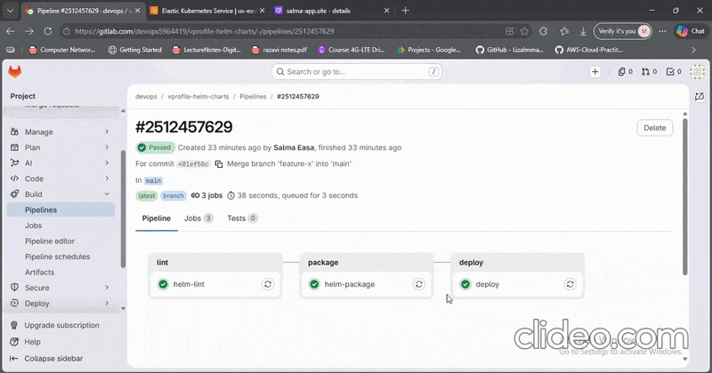


---

### GitLab Pipeline
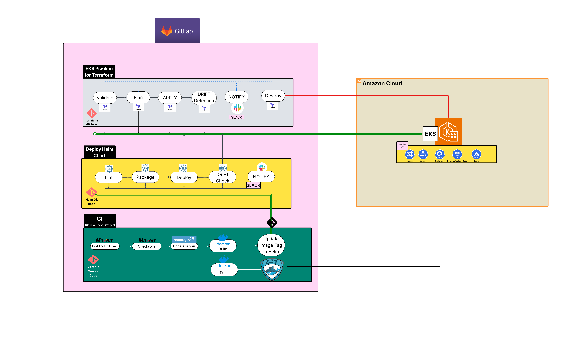

### SonarCloud Quality Gate
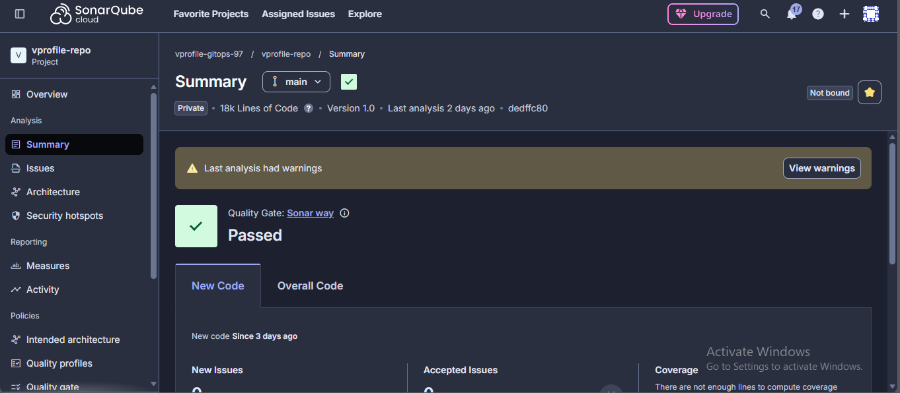

### Slack Notifications
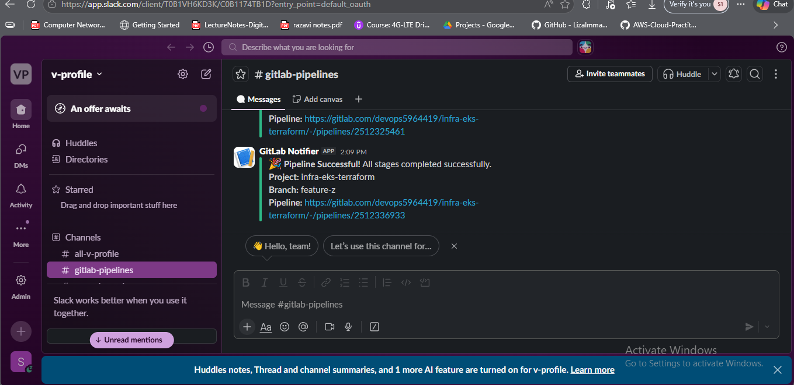

### EKS Cluster
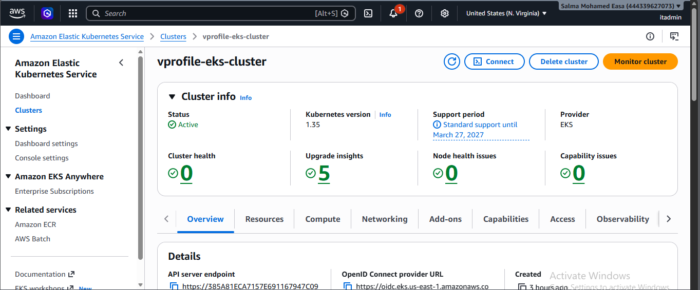

### Node Group
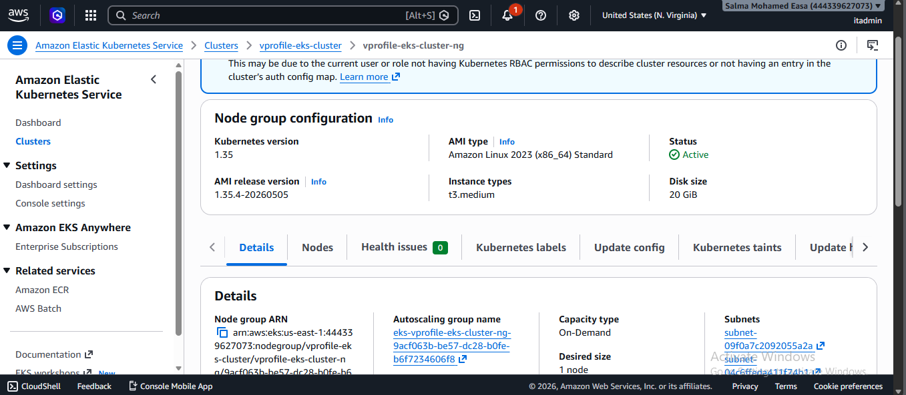

### Auto Scaling Group
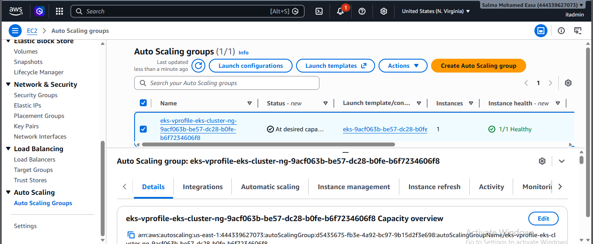

### EC2 Instances
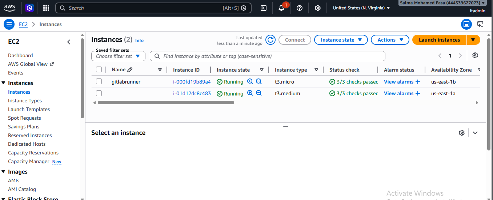

### Load Balancer
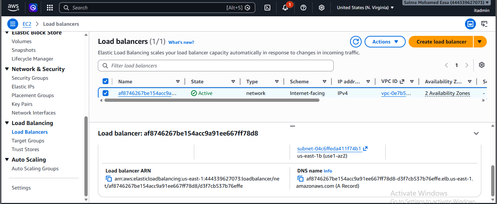

### EBS Volumes
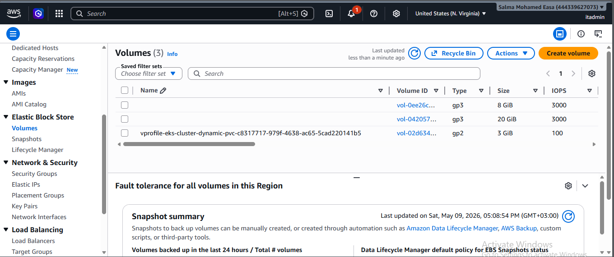

### VPC
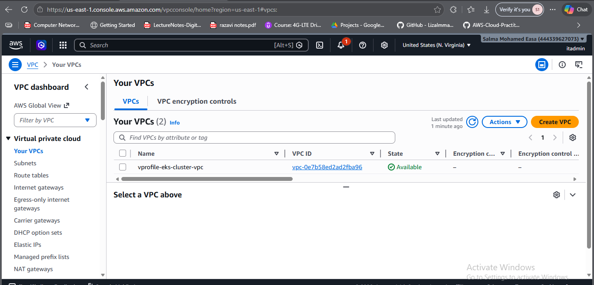

### Route 53 Record
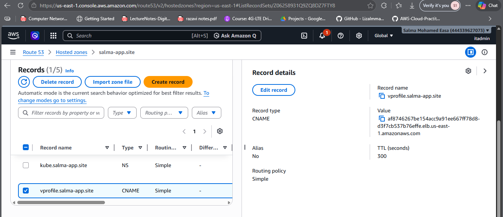

### All Namespaces
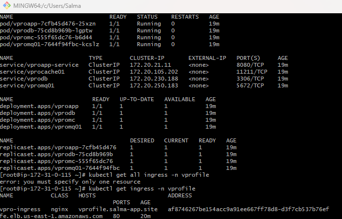

---

## Required GitLab CI/CD Variables

| Variable | Used In |
|---|---|
| `LOGIN` | SonarCloud token |
| `HOST` | SonarCloud host URL |
| `ORGANIZATION` | SonarCloud org |
| `PROJECT` | SonarCloud project key |
| `CHARTS_REPO_URL` | Helm charts repo URL |
| `CHARTS_REPO_TOKEN` | Token to push to Helm charts repo |
| `SLACK_WEBHOOK_URL` | Slack notifications |
| `AWS_ACCESS_KEY_ID` / `AWS_SECRET_ACCESS_KEY` | AWS credentials for EKS |
| `DOCKER_REGISTRY_SERVER/USERNAME/PASSWORD` | Docker registry for Helm deploy |

---

## Author

**Salma Easa** — GitLab: [@salmaeasa0](https://gitlab.com/salmaeasa0)
